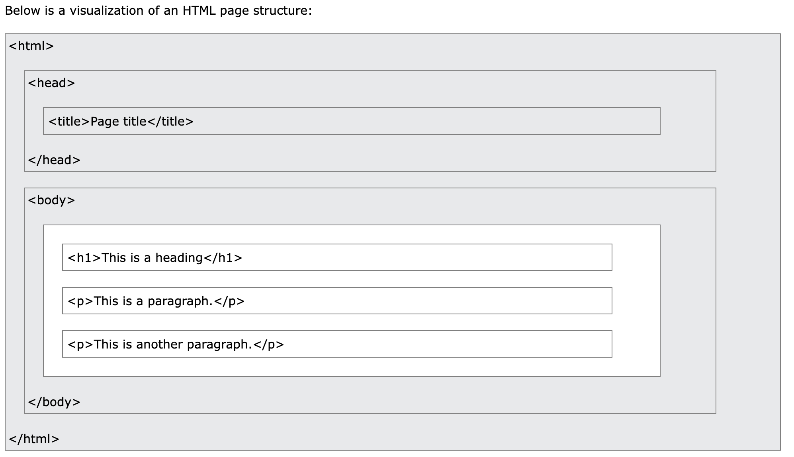

# Intro to Javascript & React - Day 2

## Agenda

1. Day 1 Recap
2. Node
3. Control Flow & Conditionals
4. Test Yourself
5. Exercise: Defining Functions
6. Arrays
7. Exercise: Working with JavaScript Arrays
8. JS & the browser
9. Events
10. Exercise: Lucky Sevens

## Overview

The Document Object Model (DOM) is a programming interface for web documents. It represents the page so that programs can change the document structure, style, and content. The DOM represents the document as nodes and objects; that way, programming languages can interact with the page. Today we explore two implementations of it, in the browser and somethign more modern via React.js.

### Learning Goals

In this lesson we:

- Continue exploring JavaScript syntax and conventions

- Briefly cover Node.js

- practice control flow

- Explore arrays, the DOM, and events before covering them in more detail tomorrow, as we transion to [React.js](https://reactjs.org/)

### HTML Refresh

**HTML** describes the structure of a Web page and consists of a series of elements. Elements tell the browser how to display the content.

#### **Page Structure**



#### **Elements**

An HTML **element** is defined by a start tag, some content, and an end tag.

```html
<tagname>Content goes here...</tagname>

<!-- I am comment -->

<!-- example elements: -->
<h1>My First Heading</h1>
<p>My first paragraph.</p>
```

#### **Attributes**

HTML **attributes** provide additional information about HTML elements. Attributes are always specified in the start tag. Attributes usually come in name/value pairs like: `name="value"`.

##### **href**

The `<a>` tag defines a hyperlink. The href attribute specifies the URL of the page the link goes to:

```html
<a href="https://www.w3schools.com">Visit W3Schools</a>
```

##### **src**

The `` tag is used to embed an image in an HTML page. The src attribute specifies the path to the image to be displayed:

```html

```

##### **style**

The HTML `style` attribute is used to add styles to an element, such as color, font, size, and more.

```html
<tagname style="property:value;">
```

The _property_ is a CSS property. The _value_ is a CSS value.

##### **id**

The `id` attribute specifies a unique id for an HTML element. The value of the `id` attribute must be unique within the HTML document.

**The `id` attribute is used by JavaScript to access and manipulate the element with the specific id.**

The syntax for id is: write a hash character `#`, followed by an id name. Then, define the CSS properties within curly braces `{}`.

```html
<h1 id="myHeader">My Header</h1>
```

## 1. Day 1 Recap

- Expectations

- Problem Solving Process

- How to Ask a Good Question

- JavaScript Basics

- Equivalence

- Functions

## 2. Node.js

[Node.js](https://nodejs.org/en/) is a JS runtime enviroment built on [Chrome's V8 JS engine](https://v8.dev/).

## 3. Control Flow & Conditionals

Control flow is the order in which a program's lines of code are executed. Generally, a computer will execute JavaScript code one line at a time, from top to bottom. But there are certain control flow mechanisms we can use to interrupt this flow.

_Read:_ [📕 JavaScript: Control Flow](https://academy.engagelms.com/mod/page/view.php?id=135572)

_Practice:_ [🛠 Code-Along: Logging Letters](https://academy.engagelms.com/mod/page/view.php?id=135573)

## 4. _Test Yourself_

1. [🧪 Exercise: If Statements](https://academy.engagelms.com/mod/page/view.php?id=135574)

2. [🧪 Exercise: for loops](https://academy.engagelms.com/mod/page/view.php?id=135575)

## 5. Exercise: Defining Functions

JS has **first class functions**:

1. Store fx's as values
2. Pass around fx's as arguments
3. Fx's can be returned from other fx's

Function can be invoke in three ways:

1. FX Style
2. Method Style
3. Constructor Style

_Read:_ [📕 JavaScript Functions](https://academy.engagelms.com/mod/page/view.php?id=135576)

_Practice:_ [🛠 Code-Along: Counting Characters](https://academy.engagelms.com/mod/book/view.php?id=135577)

_Test yourself:_ [🧪 Exercise: Defining Functions](https://academy.engagelms.com/mod/page/view.php?id=135579)

## 6. Arrays

_Read:_ [📕 JavaScript Arrays](https://academy.engagelms.com/mod/book/view.php?id=135580)

_Practice:_ [🛠 Code-Along: JavaScript Array Methods](https://academy.engagelms.com/mod/book/view.php?id=135581)

## 7. Exercise: Working with JavaScript Arrays

_Test yourself:_ [🧪 Exercise: Working with JavaScript Arrays](https://academy.engagelms.com/mod/page/view.php?id=135582)

## 8. JS & the browser

_Read:_ [📕 JavaScript and the Browser](https://academy.engagelms.com/mod/page/view.php?id=135583)

_Practice:_ [🛠 Code-Along: JavaScript and the Browser](https://academy.engagelms.com/mod/book/view.php?id=135584)

## 9. Events

_Read:_ [📕 JavaScript and the DOM](https://academy.engagelms.com/mod/page/view.php?id=135585)

_Practice:_ [🛠 Code-Along: JavaScript Form Validation and Content Control](https://academy.engagelms.com/mod/book/view.php?id=135586)

## 10. Exercise: Lucky Sevens

_Test yourself:_ [🧪 Exercise: Lucky Sevens](https://academy.engagelms.com/mod/page/view.php?id=135587)

## Summary

JavaScript is a dynamic computer programming language. It is lightweight and most commonly used as a part of web pages, whose implementations allow client-side script to interact with the user and make dynamic pages. It is an interpreted programming language with object-oriented capabilities.

The DOM represents the document as nodes and objects; that way, programming languages can interact with the page. A web page is a document that can be either displayed in the browser window or as the HTML source.

CSS is a tool to add style and depth to web pages.

### References

- [MDN Web Docs > Javascript](https://developer.mozilla.org/en-US/docs/Web/JavaScript)
- [W3 Schools > JavaScript Events](https://www.w3schools.com/js/js_events.asp)
